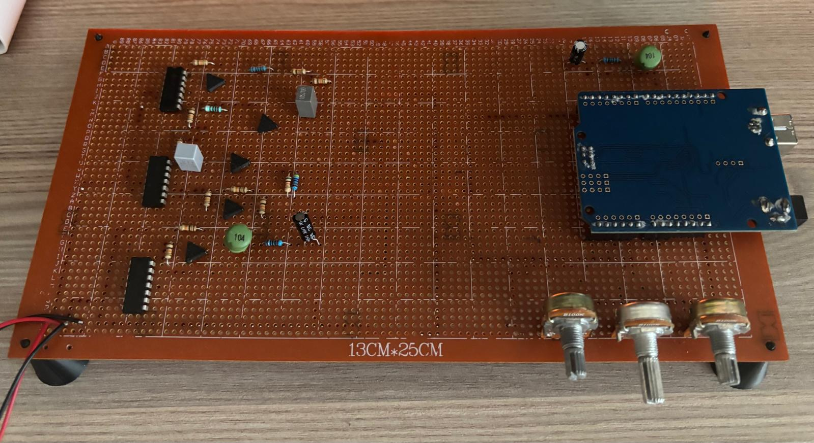
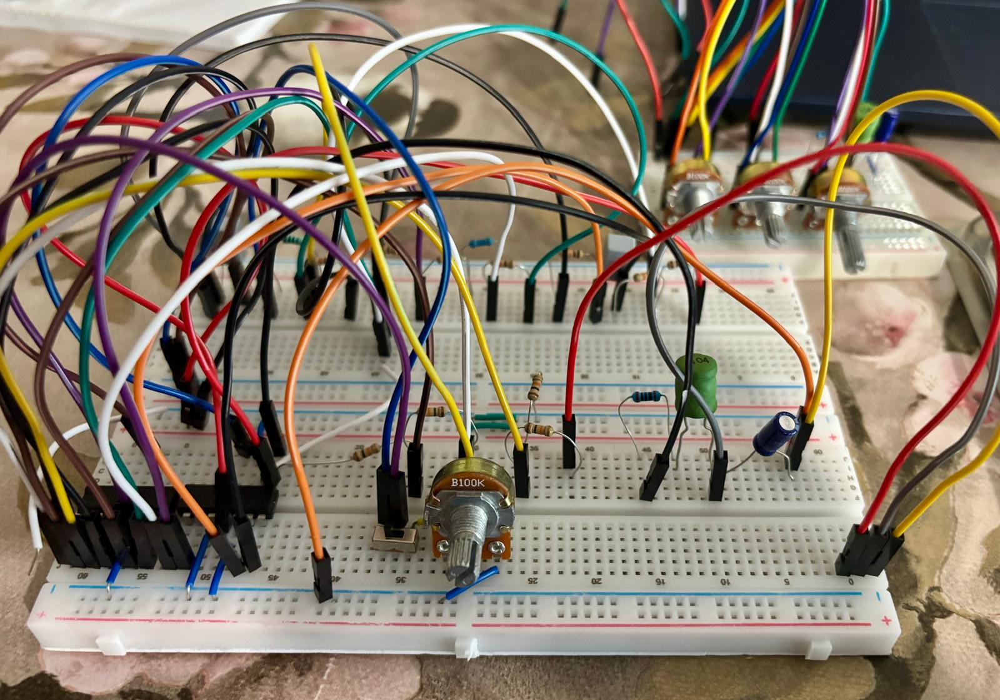
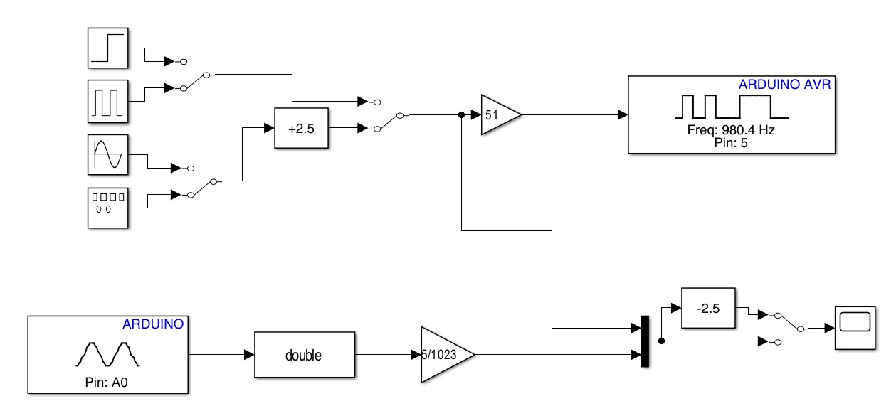
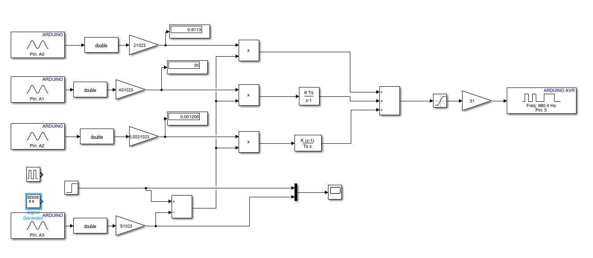
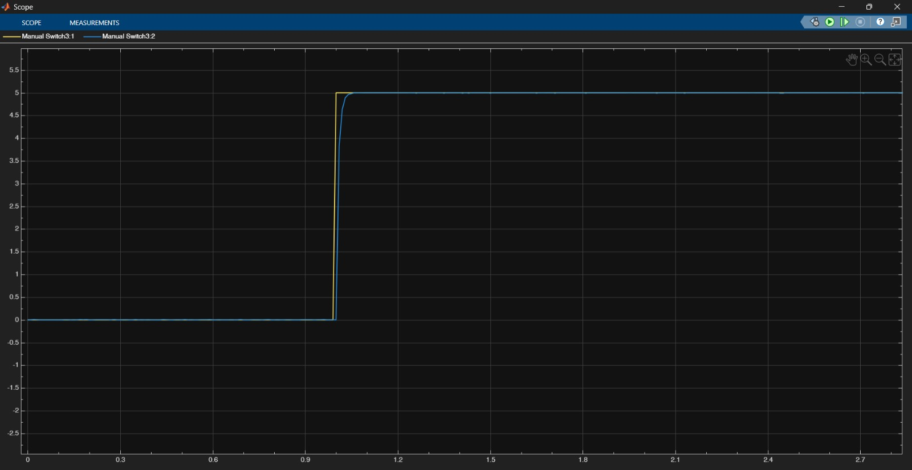
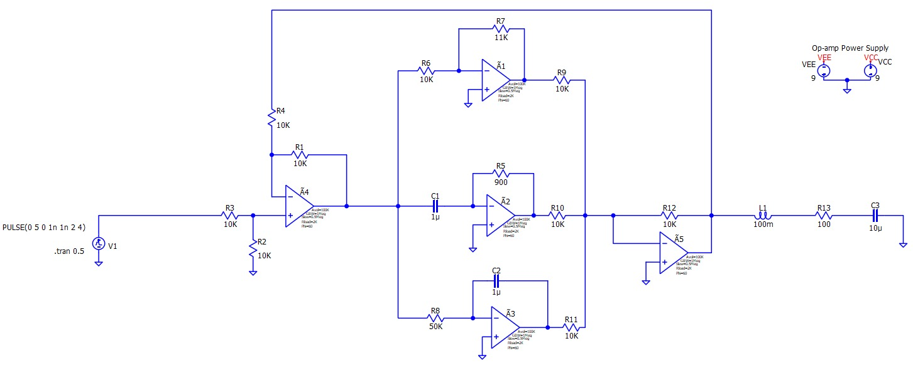

# Series RLC Circuit PID Control System

This project focuses on the modeling, simulation, and hardware implementation of a **Series RLC Circuit with PID Control**.

The project was developed as part of the **EEE302 Control Systems** course. The main objective was to analyze the dynamic behavior of a second-order RLC circuit, apply PID control approaches, and observe the system response through simulation and hardware implementation.

The project includes:

- Mathematical modeling of a series RLC circuit
- MATLAB-based calculations
- Simulink simulation models
- Analog and digital PID analysis
- Full digital PID control with potentiometer-based gain adjustment
- QSpice circuit simulation
- Arduino Uno based signal generation and measurement
- Breadboard prototype
- Soldered pertinax circuit implementation

---

## Final Hardware Implementation

The final version of the circuit was transferred from a breadboard prototype to a soldered pertinax board. This made the circuit more stable, organized, and suitable for demonstration.



---

## Breadboard Prototype

Before transferring the circuit to pertinax, the system was first tested on a breadboard.

This stage was used to verify the circuit connections, observe the system response, and make necessary adjustments before creating a permanent prototype.



---

## Project Overview

In this project, the capacitor voltage of the series RLC circuit was selected as the system output. The behavior of the circuit was analyzed using control system concepts such as transfer function representation, PID control, simulation, and experimental observation.

The project was not limited to simulation. After MATLAB, Simulink, and QSpice studies, the circuit was physically built and tested. Arduino Uno was used as an interface to send signals to the circuit and read the output response through Simulink.

This allowed us to compare the theoretical, simulation-based, and experimental behavior of the RLC circuit.

---

## System Description

A series RLC circuit is a second-order electrical system consisting of:

- Resistor
- Inductor
- Capacitor

The output of the system was selected as the capacitor voltage. Since the RLC circuit has a second-order dynamic behavior, it is suitable for observing transient response characteristics such as rise time, settling time, overshoot, and damping.

The purpose of applying PID control was to improve the system response and observe how proportional, integral, and derivative actions affect the circuit behavior.

---

## MATLAB Calculation

MATLAB was used to perform theoretical calculations and analyze the system response.

The MATLAB file is located in the `matlab` folder:

```text
matlab/Project_RLC_PID_Calculation.m
```

This file includes calculations related to the RLC circuit model and PID control analysis.

---

## Simulink Models

The project includes different Simulink models for analyzing the system from different perspectives.

The Simulink files are located in the `simulink` folder:

```text
simulink/
├── Analog_Digital_PID.slx
├── Digital_PID_on_Simulink.slx
└── Project_Simulation_Simulink.slx
```

---

## Analog and Digital PID Model

The `Analog_Digital_PID.slx` model represents the analog and digital PID control structure used in the project.

This model was used to observe the response of the RLC circuit under PID control and analyze the behavior of the system in the Simulink environment.



---

## Full Digital PID Model

The `Digital_PID_on_Simulink.slx` model represents the full digital PID control approach.

In this setup, three potentiometers were used to adjust the PID coefficients:

| Potentiometer | PID Parameter |
|---|---|
| Potentiometer 1 | Kp |
| Potentiometer 2 | Ki |
| Potentiometer 3 | Kd |

By changing the potentiometer values, the **Kp**, **Ki**, and **Kd** parameters could be adjusted. These changes were observed both on the physical circuit and in the Simulink environment.

This part of the project helped us understand how each PID coefficient affects the dynamic response of the RLC circuit.



---

## Arduino Uno Based Measurement Setup

Arduino Uno was used as a signal generation and measurement interface between the physical RLC circuit and Simulink.

In this setup:

- Arduino Uno sent input signals to the RLC circuit.
- The output response of the circuit was measured through Arduino Uno.
- The measured data was transferred to Simulink.
- Simulink was used to observe the output response of the physical circuit.

In this way, Arduino Uno worked as a simple oscilloscope-like data acquisition tool during the experimental stage.



---

## QSpice Simulation

QSpice was used to simulate the circuit before and during the hardware implementation process.

This helped verify the circuit behavior and compare simulation results with the physical implementation.

The QSpice file is located in the `qspice` folder:

```text
qspice/Project_Simulation_QSpice.qpsch
```



---

## Hardware Implementation

The hardware implementation was completed in two stages.

First, the RLC circuit and related PID control structure were tested on a breadboard. This allowed us to check the connections, verify the circuit behavior, and make adjustments easily.

After the breadboard testing stage, the circuit was transferred to a pertinax board. The components were soldered to create a more durable and organized prototype.

This process provided practical experience in:

- Component placement
- Soldering
- Circuit debugging
- Physical system testing
- Comparing simulation and real circuit behavior

---

## Project Report

The project report is included in the `docs` folder:

```text
docs/EEE302_Group_8_220403029_Project_Report.pdf
```

The report includes detailed explanations about the theoretical background, mathematical modeling, simulation results, and hardware implementation of the project.

---

## Repository Structure

```text
RLC-PID-Control-System/
│
├── README.md
│
├── matlab/
│   └── Project_RLC_PID_Calculation.m
│
├── simulink/
│   ├── Analog_Digital_PID.slx
│   ├── Digital_PID_on_Simulink.slx
│   └── Project_Simulation_Simulink.slx
│
├── qspice/
│   └── Project_Simulation_QSpice.qpsch
│
├── docs/
│   └── EEE302_Group_8_220403029_Project_Report.pdf
│
└── images/
    ├── analog-simulink-model.jpeg
    ├── arduino-simulink-measurement.jpeg
    ├── digital-simulink-model.jpeg
    ├── qspice-simulation.jpeg
    ├── breadboard-prototype.jpeg
    └── pertinax-circuit.jpeg
```

---

## Skills Practiced

This project helped improve practical and theoretical skills in:

- Control systems modeling
- Series RLC circuit analysis
- Transfer function based system representation
- PID controller analysis
- MATLAB calculation and simulation
- Simulink modeling
- Analog and digital PID comparison
- Potentiometer-based PID gain adjustment
- Arduino Uno based signal generation
- Arduino Uno based voltage measurement
- Simulink-based data observation
- QSpice circuit simulation
- Breadboard prototyping
- Soldering and pertinax circuit assembly
- Hardware debugging
- Comparing theoretical, simulated, and experimental results

---

## Tools and Technologies

- MATLAB
- Simulink
- QSpice
- Arduino Uno
- Series RLC circuit components
- Potentiometers
- Breadboard
- Pertinax board
- Soldering equipment

---

## Credits

This project was developed as part of the **EEE302 Control Systems** course.

- **Project Implementation:** Group 8 
- **MATLAB / Simulink Analysis:** Group 8
- **Hardware Prototyping and Pertinax Implementation:** Group 8
- **Group 8:**
Yahya Orçun BİLSEL
Barbaros Atıf TUNÇER
Alper ÖZKAN
Şükrü Arda SARIOĞLU
Kemal KARABAŞ
---

## License

This project is shared for educational and portfolio purposes.

You are free to review and use this project as a reference for learning, but please give proper credit if you use any part of the design, simulation files, circuit implementation, or documentation.
